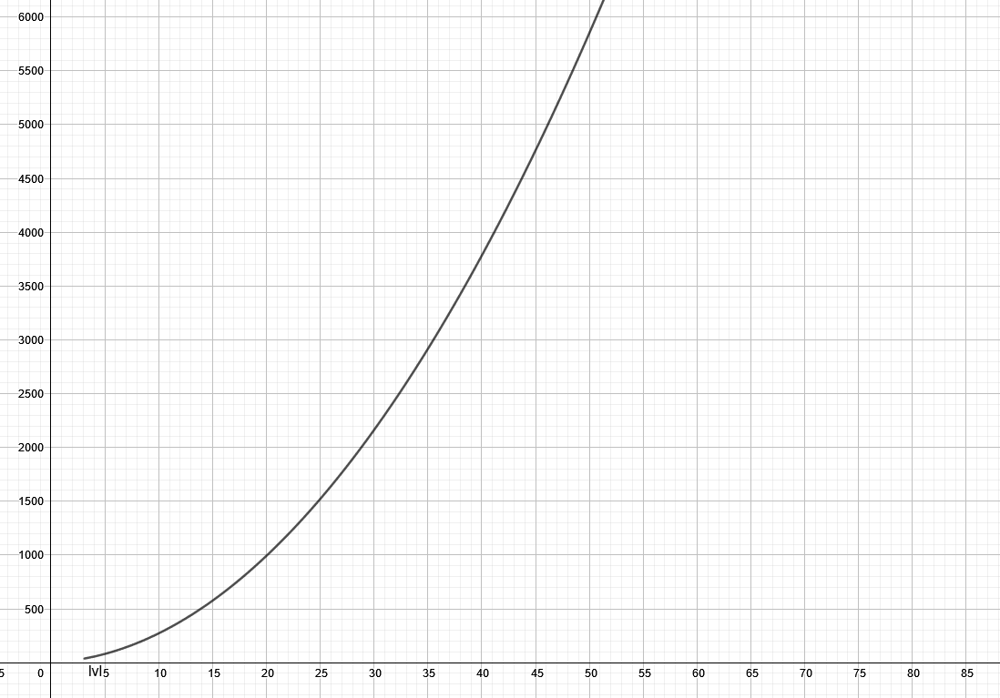

# Experience System

###### An independent  simple experience system

## About

The experience system makes it exponentially more difficult to level up. The formula which is being used
is `x = sqrt(y) / 1.5 - 1`.

*(X axis: Level, Y axis: Experience)*

The bot also sends level up messages and can give role rewards for certain levels. For the first 50 levels it will only announce the levels which are `mod 5`. *(Unless a role is rewarded)*

### Included commands:

<details>
    <summary>rank [user]</summary>

    Retrieve the rank of a user.

    Default user is the person whom has invoked the command.

    Aliases: lvl, level

    Usage examples:
        // Get your own rank
        rank

        // Get the rank of @Arthur
        rank @Arthur

</details>


<details>
    <summary>top [amount]</summary>

    Fetch the top x members with the highest exp.

    Default amount is 10.

    Usage examples:
        // Get the top 10 members
        top

        // Get the top 15 members
        top 15

</details>

## Installation

The exp system uses `humanize` and `aiosqlite` on top of the default dependency. (`utilsx`)

To install those two dependencies, copy/paste the following line.

```bash
# For Windows
$ py -3 -m pip install -U humanize aiosqlite
# For Unix
$ python3 -m pip install -U humanize aiosqlite
```

Then open the `config.cfg` file and paste the following lines at the bottom of the file:

```cfg
; The exp system config ;
[LEVELING]
notifications_guild = 728278830770290759
notifications_channel = 776227062230548502
```

After that you have done that paste the following lines at the bottom of the file:

```py
exp_system = {
    "fetching": "Fetching data...",
    "title": "{user} rank",
    "message": """{user.mention} statistics:
    Level: {data.level}
    Exp: {data.exp}/{data.exp_next_level} *({data.left} left)*
    Currently on server position {data.server_rank} of {data.server_total}""",

    "top_msg": "The requested amount can not be more than 25!",
    "max_top": 25,
    "top_title": "Top Users",
    "top_line": "**{idx}**. <@!{user.id}>: {user.level} *({user.exp} exp)*",

    "levelup_message": "Congratulations <@!{author.id}>, you just leveled up to level {lvl}! ",
    "levelup_message_role": "And you have been awarded the {role.mention} role!"
}
```

There is one final step to complete the installation, that is moving the `exp_roles.py` file into the `config` folder.

## Configuration

### config.cfg

```cfg
[LEVELING]
notifications_guild = 728278830770290759 <- The server in which you are using the bot.
notifications_channel = 776227062230548502 <- The channel where notifications will be sent when a user level ups. Remove to disable feature.
```

### exp_roles.py

Level represents the threshold, once the threshold has been reached the role which has the same ID as the `role_id` will be given to the user.

```py
exp_roles = {
    level: role_id,
    level: role_id
}
```
